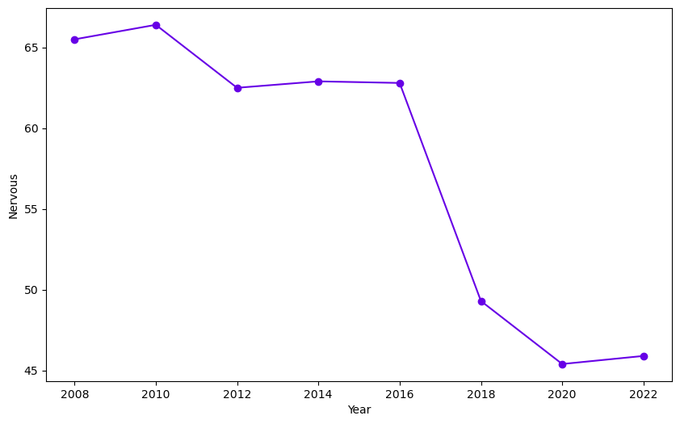
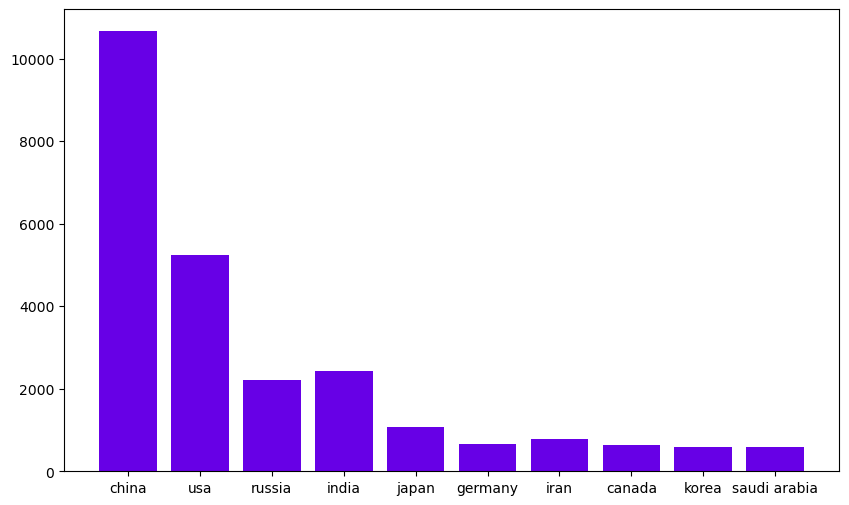
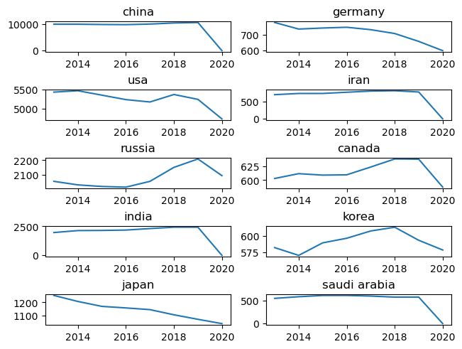
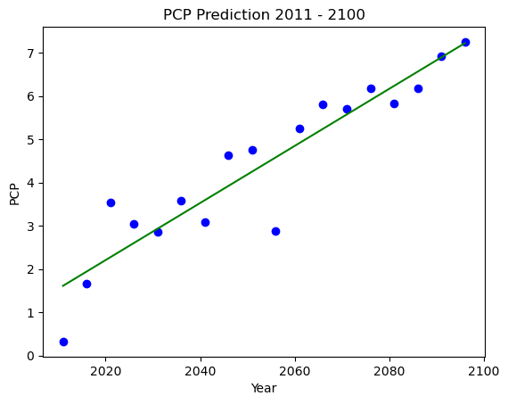
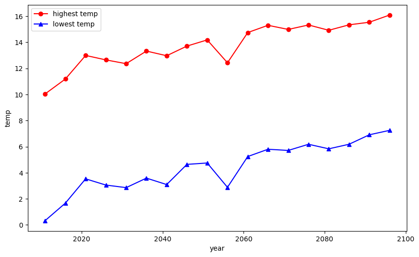

## 분석 데이터 참고 자료 (서민재)

### 1. climateNervousData

### 기후위기에 대한 인식 조사 (약간 불안함 ~ 불안함)

- Col: year(연도별), nervous(약간 불안함), nervous so much(매우 불안함), total(합계)
- Row: 연도별 불안함 정도
    
  < 참고 시각화 도표 >
  

 

### 2. gasTop10Data

### 온실가스 배출량 상위 10개국 통계자료

- Col: 국가별
- Row: 연도별 온실가스 배출량  
  < 도표1 > 2019년기준 온실가스 배출량 비중
  
  < 도표2 > 2008 - 2020년까지 온실가스 배출 추이
  
  ※ 2020년에 0으로 내려오는 국가는 배출량이 측정되지 않은 국가임.

 

### 3. climateScenario

- Col: YR(연도별), PCP(일일 강수량 평균), TMAX(일 최고기온 평균), TMIN(일 최저기온 평균)
- Row: 연도별 수치   
  <도표1> 2011-2100년 강수량 변화 예측
  
  <도표2> 2011-2100년 기온 변화 예측
  
