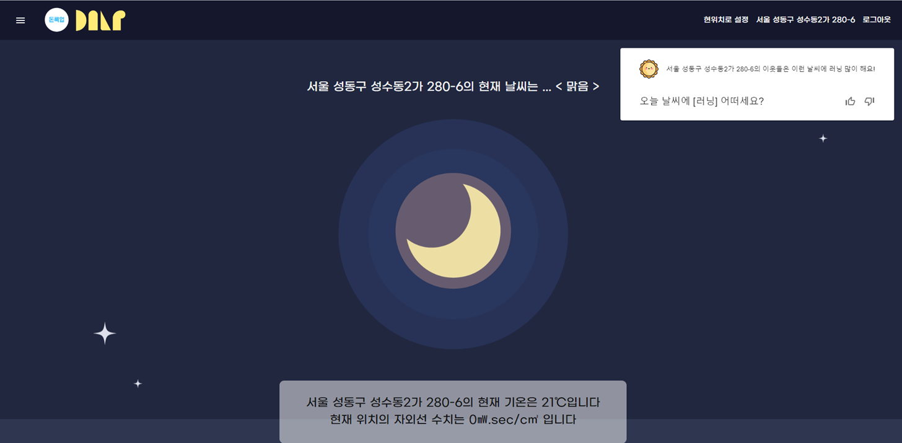
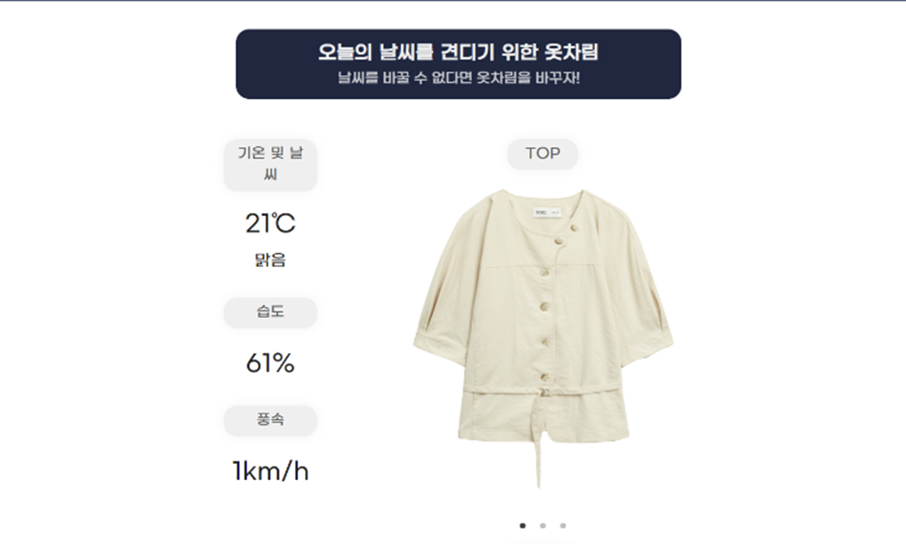
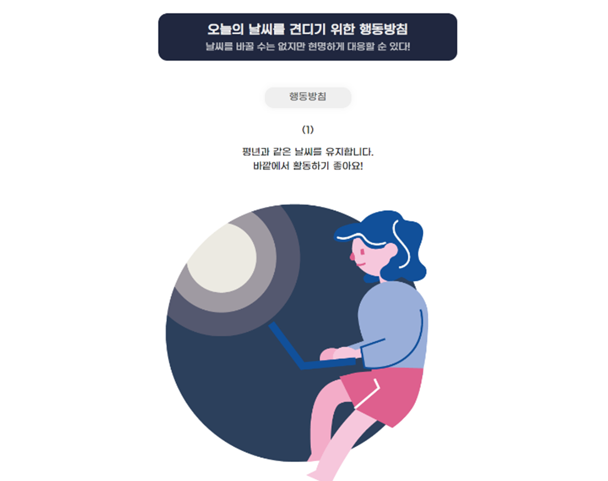
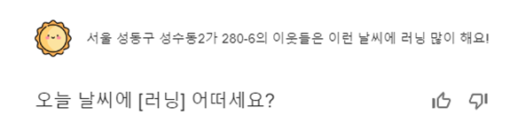
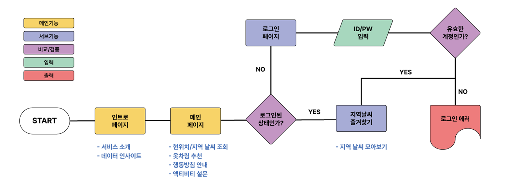
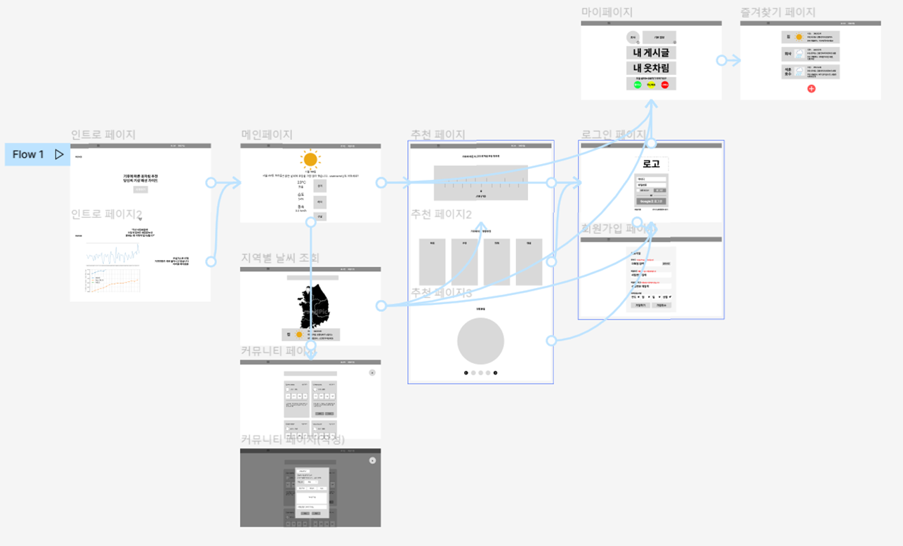
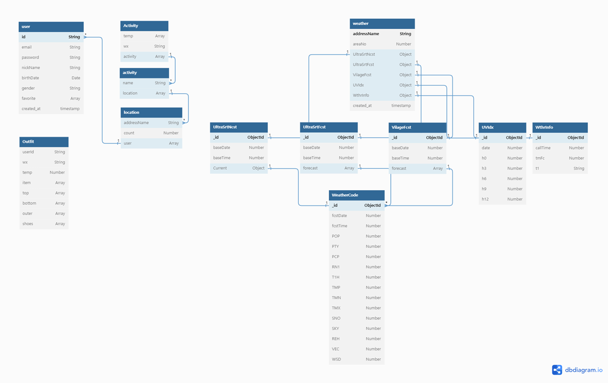

## 📢 **기후에 따른 라이프 스타일 추천: 당신의 생활 가이드**

---

 

## 📌 **개요**

- 서비스명: 돈룩업(Don't look up)
- 기획기간: 2023.05.29 - 2023.06.06
- 개발기간: 2023.06.05 - 2023.06.17
- 주제: 기후변화
- 목표: 현위치 및 지역 기반 기상청 API 통신을 통한 실시간 날씨 정보 시스템 구축 및 날씨 기반 옷차림 및 생활방침 정보 공유 서비스 제공

 

## 🧐 **팀원 소개**

---

 

### 🍀 **김태은**

- **Front-End**
- email

### 🍀 **서민재**

- **Back-End**
- winterfeel97@gmail.com

### 🍀 **손태린**

- **Back-End**
- email

 

## 🖥 **기술스택**

---

### **Front-End**

 
  
 

 

### **Back-End**

 

## 📢 **주요기능**

---

 

### **" 급변하는 날씨 속, 우리는 어떻게 살아가야 할까요? "**

 

- 1960년대부터 꾸준히 올라간 기온은 전 지구적으로 **이상기후**를 불러왔어요.
- 그러나, OECD를 비롯한 여러 나라의 기후 대책은 지금의 기후 변화를 막기에는 **불충분**해요.
- 앞으로의 기후변화 시나리오는 기온 및 강수량이 **계속 늘어날 것**으로 전망하고 있어요.

 

### ✨ **실시간 날씨 조회**

---

 

- **현위치 및 로컬 api를 기반**으로 지역정보를 불러와 기상청 api를 호출합니다.
- 기상청으로부터 실시간 날씨 정보를 받아와 기온 및 자외선, 날씨, 기상정보문 등, 전반적인 **날씨 정보**를 제공합니다.
- 자주 검색하는 장소는 즐겨찾기에 등록할 수 있어요.

   

### ✨ **날씨 기반 라이프 스타일 추천**

---

 

- 기온 및 날씨 정보를 기반으로 **기온별 옷차림** 및 **날씨별 소지품(준비물)**을 추천합니다.
- 한파/폭염 여부에 따라 극단적인 날씨에 대응할 수 있는 **행동방침**을 제공합니다.

   

### ✨ **액티비티 추천 시스템**

---

 

- 나와 같은 지역 이웃이 즐긴 액티비티를 추천 받아요.
- 나 역시 액티비티를 추천하여 날씨별 **액티비티 데이터의 일부로 기여**해요.

 

## 🚲 **개발 관련 자료**

---

 

### **1 ) 플로우차트**

 

### **2 ) 와이어프레임**

 

### **3 ) Erd 설계**

